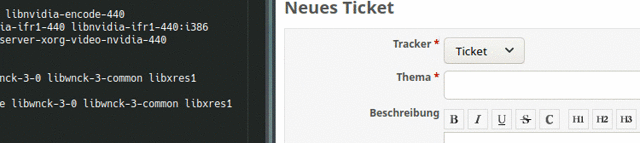

# Ulauncher extension for redmine

Access your redmine tickets via ulauncher.

Relies on https://github.com/maxtepkeev/python-redmine

## Installation

* Open Ulauncher
* Settings
* Extensions
* Add extension
* Paste the link to this repository "https://github.com/berti92/ulauncher-redmine-extension"
* Press "Add"

## Configuration

* Open Ulauncher
* Settings
* Extensions
* Click "redmine" on the left"
* Fields
   * Redmine keyword = Keyword to activate the plugin
   * Redmine URL = Url to your redmine installation
   * Redmine API KEY = Api-Key to access your redmine installation
   * Redmine Version = Version of your redmine installation

## License

MIT
